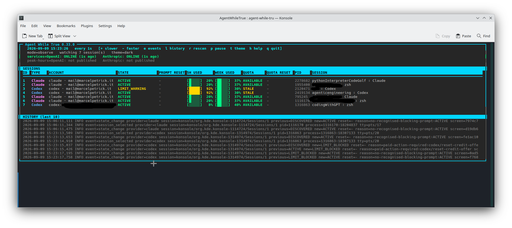

# Agent While True

[](https://github.com/marcelpetrick/AgentWhileTrue/actions/workflows/quality.yml)
[](https://github.com/marcelpetrick/AgentWhileTrue/actions/workflows/release.yml)
[](https://www.python.org/)
[](LICENSE)

**Agent While True** is an agent budget watch and babysitter for Codex CLI and
Claude Code sessions in KDE Konsole. It reports provider quota health and can
resume a blocked session after usage becomes available again—only when the
terminal, process identity, prompt, quota source, and policy all agree.

**Author: Marcel Petrick <mail@marcelpetrick.it>**

**License: GPLv3 or later. See `LICENSE`.**

**Note: project is generated with AI.**

## Current state of the solution



The main interface keeps independently recognized terminal state and provider
quota visible for every selected Codex and Claude session. Red or unknown data
does not authorize terminal input; the supervisor continues to fail closed.
Interactive dashboards identify the authenticated account for each individual
session. A Codex profile home such as `~/.codex-dmo` is rendered as
`codex-dmo · business@example.com`, while the default is rendered as
`codex · private@example.com`. This display-only identity is never written to
Agent While True's log or persistent state.

Shell aliases themselves cannot normally be recovered after Zsh expands them.
However, an alias such as `codex-dmo` that selects a distinct `CODEX_HOME` leaves
that profile identity on the child process, allowing the dashboard to infer the
profile label and read its matching account email safely.

Every session row includes five-hour and weekly used-percentage meters plus the
time remaining until each individual reset. For example, `[████░] 84% 3h`
means that 84% of the window has been used and it resets in at most three hours.
Countdowns below 1.5 days use `h`; longer countdowns use `d`. `PROMPT RESET` is
the reset time parsed from the blocking terminal prompt; `QUOTA RESET` is the
separate effective reset time reported by the provider quota source.

The header reports public service health for OpenAI Codex API and Anthropic
Claude Code/API. These are cached observations from the providers' public JSON
status APIs, not paid model calls, and `UNKNOWN` is shown when the network,
schema, component identity, or component status is unusable. Each provider is
polled independently once per second in the background by default
(`STATUS_POLL_INTERVAL=1s`), so one slow endpoint cannot delay the other. The
client requests gzip and uses ETag revalidation when offered, keeping unchanged
responses small. One second is the enforced lower bound; increase it if you
prefer less network traffic.

The primary command is `agent-while-true`. The shorter `agent-watch` command is
kept as a compatible alias, so existing scripts and the examples below continue
to work.

The current target is Manjaro/Arch Linux, KDE Plasma, Konsole, Wayland or X11,
and Python 3.12 or newer. Runtime code uses only the Python standard library.


This real prompt is handled narrowly. With fresh quota confirming the session is
exhausted, auto mode may move from the visibly selected first item to the exact
“continue automatically” item and confirm it. It never selects “upgrade your
plan.” Any different menu, cursor position, or unknown quota fails closed.

## Install

Install the current release from GitHub with `pipx` so the CLI is isolated while
remaining available at `~/.local/bin/agent-while-true`:

```bash
pipx install 'git+https://github.com/marcelpetrick/AgentWhileTrue.git@agentwhiletrue-v0.36.9'
agent-while-true --version
agent-while-true doctor
```

For development, clone the standalone repository:

```bash
git clone https://github.com/marcelpetrick/AgentWhileTrue.git
cd AgentWhileTrue
python3 -m venv .venv
.venv/bin/python -m pip install -e '.[dev]'
PATH="$PWD/.venv/bin:$PATH" ./localPipeline.sh
```

For an end-to-end setup from a checkout, including all checks and the main
interface, run:

```bash
./fullAutoMode.sh
```

The launcher runs the complete release gate, installs that verified wheel with
`pipx`, creates the default configuration if needed, requires `doctor` to pass,
shows live status and quota, and then opens the auto-mode dashboard for all
eligible sessions. Invoking it explicitly opts Codex into composer continuation;
paid, upgrade, reset-credit, and model-downgrade actions remain forbidden. If
another input-capable watcher already owns the lock, it stays in control and the
launcher opens an observe-only dashboard. Use `./fullAutoMode.sh --noRun` to do
the setup and checks without starting the interface.

## See what is running

```bash
agent-while-true status
agent-while-true quota
```

`status` classifies visible Konsole sessions. `quota` is read-only and reports
provider availability, failures, usage percentages, and the reset time for each
known window:

```text
Claude pts/4 PID 769257
  availability: EXHAUSTED
  source:       claude-statusline
  session       100.0%  reset 03:20 (4h)
```

Provider state and terminal state are intentionally separate. A quota may be
available while a terminal is active, or a terminal may show an old limit while
provider data is unavailable. Unknown or stale quota data never authorizes input.
For Codex, a process whose rollout stopped updating may use a fresher observation
from another live process only when both rollouts resolve to the same validated
local account and rate-limit identity. Unidentified and different accounts are
never combined; the opaque binding remains in memory and is not logged.

## Watch sessions

Konsole disables input-capable D-Bus calls by default on current releases.
Enable the setting once, then restart Konsole before using ask or auto mode:

```bash
kwriteconfig6 --file konsolerc --group KonsoleWindow \
  --key EnableSecuritySensitiveDBusAPI true
```

This permission lets programs running as your desktop user type into Konsole,
which is why Agent While True layers process identity, exact prompt recognition,
policy, idempotency and immediate revalidation on top. `agent-while-true doctor`
probes the permission with an empty string and blocks auto mode if it is off.

The setting is read when a Konsole process starts. Existing windows therefore
remain input-disabled until Konsole is restarted; keep the current sessions
open until their work is safe, then restart Konsole once and require
`agent-while-true doctor` to report both `Konsole input OK` and `Auto mode OK`.
Agent While True cannot bypass this Konsole boundary, and intentionally does not
kill or replace existing terminal sessions.

Start with observe mode. It runs the complete detection path but cannot type:

```bash
agent-while-true run --observe --all
```

Only one input-capable instance may run. If the background service owns the
lock, stop it before opening the interactive TUI, then restore it after quitting:

```bash
systemctl --user stop agent-watch.service
agent-while-true run --observe --all  # press Shift+A to enable full auto
systemctl --user start agent-watch.service
```

On an interactive terminal this opens a fully framed color dashboard inspired
by btop and ollamaFarm. Dark, vivid, CGA, and amber style the whole surface,
section bars, table headers, borders, provider/account cells, states, usage
meters, service health, history, and help. Colors carry meaning: green is
available/healthy, yellow is waiting or unknown, and red is exhausted or
unsafe. `NO_COLOR=1`, `--no-color`, or the plain theme produces ANSI-free
output.

| Key | Effect |
| --- | --- |
| `-` / `+` | Refresh faster / slower across `0.25 0.5 1 2 3 5 10 30 60` seconds |
| `A` | Toggle observe/full-auto; uppercase activation is an explicit Codex resume opt-in |
| `p` | Pause/resume; pause performs no terminal or quota polling |
| `r` | Rediscover Konsole sessions immediately |
| `t` | Cycle dark, vivid, CGA, amber, and plain themes |
| `e` | Show or hide persisted action/state history |
| `l` | Cycle displayed history through 5, 10, 20, and 50 retained rows |
| `h` or `?` | Toggle the in-dashboard help |
| `q` | Quit and restore the terminal |

Like btop, `+` makes the interval number larger and therefore refreshes more
slowly. Selected sessions use that interval, while full Konsole rediscovery runs
every 30 seconds or immediately after `r`; this avoids spawning discovery calls
on every dashboard frame. Non-interactive observe output stays ANSI-free and
separates scans with a blank line for readable logs.

Other modes are:

```bash
agent-while-true run --ask       # select sessions and confirm each action
agent-while-true run --auto      # select sessions; resume policy-approved prompts
agent-while-true simulate --all  # exercise the built-in danger scenarios
```

Claude continuation is normally a bare Enter only when Claude explicitly asks
for it. Its exact three-choice menu may also be armed so Claude itself continues
at reset; set `ALLOW_CLAUDE_AUTO_WAIT=false` to disable that behavior. Codex has
no equivalent affordance, so Codex auto-resume remains disabled unless
`ALLOW_CODEX_AUTO_RESUME=true` is intentionally configured. Model downgrades,
paid credits, purchases, upgrades, and reset-credit redemption are never enabled
by the supplied configuration.

Current Codex versions may append Pro and credit-purchase links to the ordinary
usage-limit message. Those links are passive text above a separate composer:
Agent While True may type its configured continuation into that composer only
after the exact tested limit/reset message and fresh provider availability both
agree. It never follows or selects a paid link, and any additional paid,
reset-credit, or model-changing prompt still vetoes the action.

Codex treats a rapid text-and-Enter stream as a paste and turns that Enter into
a newline. Agent While True therefore wraps its continuation in the terminal's
bracketed-paste markers and follows it with Enter in the same revalidated D-Bus
write. This preserves a genuine submit event instead of leaving `continue` in
the composer.

Create and inspect the default configuration with:

```bash
agent-while-true init
agent-while-true config
```

The file is `~/.config/agent-watch/config`. It is parsed as data and never
sourced as shell code. Logs and state live under
`~/.local/state/agent-watch/`; terminal contents are not logged. Agent While
True records structured state transitions and actions in
`~/.local/state/agent-watch/agent-watch.log`, including when an action was
planned, sent, verified, refused, retried, or failed. Inspect recent history
with:

```bash
agent-while-true logs -n 40
journalctl --user -u agent-watch.service -f  # service lifecycle/output
```

The dashboard's `HISTORY` panel reads the same privacy-preserving event file.
It retains the latest 50 entries in memory, even while showing only the chosen
5, 10, 20, or 50 rows, so expanding the panel reveals what happened while you
were away. Successful terminal retriggers appear as `resume_sent`, followed by
their verification result. History records fingerprints and pattern IDs, never
terminal text, prompts, credentials, or environment values.

Codex is launched through a Node.js shim on current installations, so Konsole
may label its tab or foreground command `node`. Agent While True walks the child
process tree, classifies the native Codex process, reads quota from that process,
and presents the session as `Codex` in its own dashboard.

## Claude quota bridge

The bridge is the supplied `scripts/claude-statusline-proxy.sh`, not another
package, daemon, plugin, or network service. Claude Code exposes quota data only
to its configured status-line command. The bridge receives that JSON, copies
only the usage windows and reset timestamps to Agent While True's state directory,
and then runs your existing status line with the original JSON.

Without it, `agent-while-true quota` honestly reports Claude as `UNKNOWN` with
`no-statusline-file`. Prompt detection still works, but automatic mode will not
guess that quota is available.

Install and safely chain the supplied file in one command:

```bash
scripts/install-claude-bridge.sh
```

The installer copies the proxy, backs up `~/.claude/settings.json`, and preserves
the existing status-line command through the chain. To do those steps manually,
install the one supplied file:

```bash
install -Dm755 scripts/claude-statusline-proxy.sh \
  ~/.local/share/agent-watch/claude-statusline-proxy.sh
```

Configure it as Claude's `statusLine` command in `~/.claude/settings.json`:

```json
{
  "statusLine": {
    "type": "command",
    "command": "~/.local/share/agent-watch/claude-statusline-proxy.sh"
  }
}
```

If a status line already exists, preserve it through
`AGENT_WATCH_STATUSLINE_CHAIN`:

```json
{
  "statusLine": {
    "type": "command",
    "command": "AGENT_WATCH_STATUSLINE_CHAIN=~/.claude/my-statusline.sh ~/.local/share/agent-watch/claude-statusline-proxy.sh"
  }
}
```

For example, if the current command is
`~/.claude/abtop-combined-statusline.sh`, the replacement is:

```json
{
  "statusLine": {
    "type": "command",
    "command": "AGENT_WATCH_STATUSLINE_CHAIN=~/.claude/abtop-combined-statusline.sh ~/.local/share/agent-watch/claude-statusline-proxy.sh"
  }
}
```

Restart Claude Code if it does not reload the setting, wait for one status-line
render, then verify the bridge without enabling automation:

```bash
agent-while-true quota
ls -l ~/.local/state/agent-watch/quota/claude.json
```

The bridge writes an owner-only, atomically replaced quota document at
`~/.local/state/agent-watch/quota/claude.json`. Failures do not prevent the
existing status line from running.

## Background service

Install the supplied user service from this checkout:

```bash
scripts/install-user-service.sh
systemctl --user enable --now agent-watch.service
systemctl --user status agent-watch.service
```

The shipped service is observe-only. It may discover new agent tabs, but it can
never send input. After validating `doctor`, `quota`, observe mode, and the
simulations, auto mode can be explicitly enabled with:

```bash
systemctl --user edit agent-watch.service
```

```ini
[Service]
ExecStart=
ExecStart=%h/.local/bin/agent-while-true run --auto --all --no-fzf
```

Then run `systemctl --user restart agent-watch.service`. Remove the service with
`scripts/install-user-service.sh --uninstall`.

## Safety model

Immediately before any input, Agent While True re-reads and verifies:

- the explicitly selected Konsole session;
- PID, process start time, TTY, and provider classification;
- a current, known prompt and its permitted action;
- fresh provider quota with no other exhausted window;
- the persisted prompt fingerprint and retry budget.

SSH, containers, tmux/screen, unknown prompts, stale quota, provider errors,
process replacement, and paid or quality-changing choices all fail closed. A
single-instance lock and persisted `PLANNED -> SENT -> VERIFIED|FAILED` action
lifecycle prevent duplicate input across concurrent processes and crashes.

See [vision.md](vision.md) for product intent, [PLAN.md](PLAN.md) for the
implementation sequence, [ARCHITECTURE.md](ARCHITECTURE.md) for the C4 model and
runtime safety flows, and [todo.md](todo.md) for the remaining live-machine
acceptance steps.

## Development and release

```bash
./localPipeline.sh
AGENT_WATCH_LIVE_KONSOLE=1 python3 -m pytest -q -m konsole
```

The local pipeline is the canonical release gate. It checks Python 3.12+, Ruff
lint and formatting, every tracked shell script with mandatory ShellCheck,
`git diff --check`, pytest with an 85% coverage floor, all built-in danger
simulations, sdist/wheel construction, and an isolated install exercising
`doctor`, `status`, `quota`, simulations, and both command names. GitHub Actions
runs this same script on Python 3.12, 3.13, and 3.14.

Pushes to `master` and pull requests run the quality workflow. A tag named
`agentwhiletrue-vX.Y.Z` additionally verifies the tag against the package
version and changelog, reruns the pipeline, and publishes the built wheel and
source distribution as a GitHub release.

Release tags use `agentwhiletrue-vX.Y.Z`. The project follows semantic
versioning while major version zero denotes an alpha interface.

## License

Agent While True is licensed under the
[GNU General Public License v3.0 or later](LICENSE). The package metadata declares
the `GPL-3.0-or-later` SPDX expression and includes the license in built
distributions.
