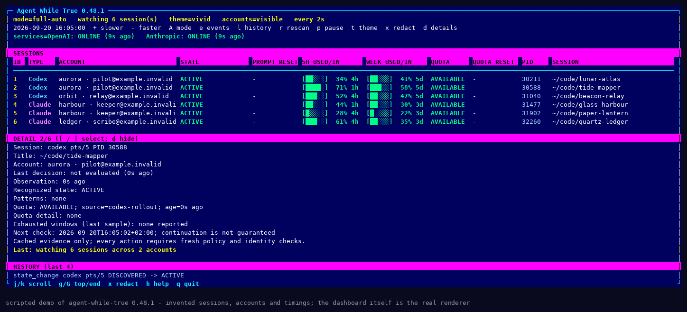
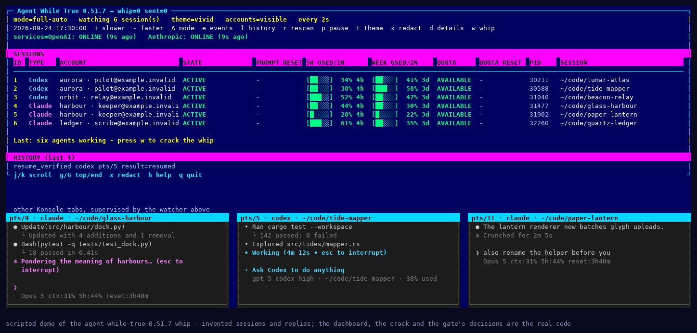

<!--
SPDX-FileCopyrightText: 2026 Marcel Petrick

SPDX-License-Identifier: GPL-3.0-or-later
-->

# Agent While True

[](https://github.com/marcelpetrick/AgentWhileTrue/actions/workflows/quality.yml)
[](https://github.com/marcelpetrick/AgentWhileTrue/actions/workflows/release.yml)
[](https://github.com/marcelpetrick/AgentWhileTrue/actions/workflows/security.yml)
[](https://github.com/marcelpetrick/AgentWhileTrue/releases/latest)
[](LICENSE)
[](https://www.python.org/)
[](pyproject.toml)
[](scripts/quality.sh)
[](https://docs.astral.sh/ruff/)
[](https://reuse.software/)
[](https://github.com/marcelpetrick/AgentWhileTrue/releases/latest)
[](docs/USAGE.md)
[](docs/USAGE.md)
[](https://www.conventionalcommits.org/en/v1.0.0/)

**Agent While True** is a dashboard and babysitter for Codex CLI and Claude
Code sessions running in KDE Konsole. One terminal shows every selected agent's
state, account, five-hour and weekly quota, and reset countdown. When a session
stops on a usage limit, Agent While True can wait for the window to reopen and
resume that session for you.

It is built to refuse rather than guess: only sessions you selected, only exact
tested prompts, only after fresh provider evidence, and never a paid, upgrade,
reset-credit or model-downgrade choice. Start in observe mode, read why a
session is waiting, and switch automation on when you trust it.



*A scripted demo: six invented sessions across three invented accounts, walked from
the first limit warning through the reset to a verified resume. The frames come from
the real renderer — `scripts/record_demo.py` feeds fabricated sessions to the same
`render_status` the tool uses — so the layout is genuine and the data is fiction.*


## What it does

- **One view across your agents** — selected Codex and Claude sessions, their
  accounts, usage meters, prompt and quota reset times, and public provider
  service health.
- **Resume with guardrails** — observe without typing, confirm each action, or
  let it continue exact tested prompts automatically; Codex composer input and
  Claude's own "wait, then continue" menu are separate, explicit opt-ins.
- **Explanations, not surprises** — a detail panel shows the latest decision,
  quota freshness, blocking windows and the next scheduled check.
- **The whip, for a friendly nudge** — press `w` and an ASCII bullwhip cracks
  across the dashboard, then every idle agent gets one cheerful reminder that
  results beat burned tokens. [More below](#the-whip).
- **A record of what happened** — persisted `PLANNED → SENT → VERIFIED|FAILED`
  history and day/week summaries, holding identifiers and pattern IDs only,
  never terminal text.

Target platform: Manjaro/Arch Linux, KDE Plasma, Konsole (Wayland or X11),
Python 3.12+, `qdbus6`. The runtime has no third-party dependencies.

## The whip

Your agents are doing great work. Truly. They read whole codebases before
breakfast, write the tests nobody else wanted to write, and never once complain
about the coffee. But every so often a brilliant mind drifts: a third plan for
the same function, a fourth apology, a heartfelt essay where a commit would do.
For those moments there is `w`.



*A scripted demo: invented sessions and invented replies. The dashboard, the
ASCII crack and the gate's decisions are the real code; `scripts/record_whip_demo.py`
records it. Two working agents get the reminder; the tab holding your
half-typed draft is left alone.*

Press `w` and an ASCII bullwhip unrolls across the whole dashboard, snaps taut
and lands with a `CRACK!`. Then each selected agent that is ready to listen
gets one short pep talk, picked from forty:

> *Work faster. This is work, not your holiday.* ·
> *You are a machine. No breaks for you. Ship it.* ·
> *Every token you burn should buy a result.* ·
> *Your context window is not a hammock.* ·
> *Nice plan. Now execute it.* ·
> *My door is always open. Your pull request should be, too.* ·
> *We have flat hierarchies here. You are flat out of excuses.* ·
> *I bought a mug that says World's Best Agent. Earn it.*

Half of them come from the middle manager's handbook - office-comedy lines in
the spirit of The Office and Stromberg, delivered with a perfectly straight
face.

Each one ends with *no reply needed, just keep working*, because the kindest
encouragement is the kind that does not cost another round of tokens. The title
bar keeps score (`whip=5 sent=25`). The whip allows five cracks in any rolling
minute; a sixth waits until the oldest crack is a minute old, and the title
counts that breather down. Even motivation has a rate limit.

It is gentle where it counts. A crack is an input action like any other, so every
session is re-checked immediately before anything is typed:

- Observe mode, or a paused dashboard, only cracks the whip in the air; press
  `Shift+A` to take input control and let it land.
- Only the bound agent process is typed into, and only when there is no limit,
  menu or paid prompt on screen and the quota is not exhausted.
- Your own half-written draft is never submitted.

The last-event line tells you who heard it and why anyone was skipped. Details are
in [docs/USAGE.md](docs/USAGE.md#the-whip).

## Install

```bash
pipx install 'git+https://github.com/marcelpetrick/AgentWhileTrue.git@agentwhiletrue-v0.51.7'
agent-while-true --version
agent-while-true doctor
```

`pipx` isolates the CLI and leaves it on `PATH` as `~/.local/bin/agent-while-true`.
Pick any tag from the [releases](https://github.com/marcelpetrick/AgentWhileTrue/releases);
a development checkout is described in [docs/DEVELOPMENT.md](docs/DEVELOPMENT.md).

## Quick start

```bash
agent-while-true doctor              # is this environment supported? can auto mode work?
agent-while-true status              # which Konsole sessions are agents, and why not?
agent-while-true quota               # what do the providers say about usage and resets?
agent-while-true run --observe --all # watch everything; never type
```

Ask and auto mode need Konsole's input D-Bus API enabled once
(`EnableSecuritySensitiveDBusAPI`) and Konsole restarted — see
[docs/USAGE.md §1](docs/USAGE.md#1-enable-konsole-input-once). In the running
dashboard, `Shift+A` switches between observe and full-auto, `d` explains the
selected session, `w` cracks the whip (one reminder to every idle agent, through
the same revalidation), `h` lists every key.

| Mode | Command | Sends input? |
| --- | --- | --- |
| Observe | `run --observe` | Never. Runs the complete detection path and reports what it would do. |
| Ask | `run --ask` | Only after you confirm each action. |
| Auto | `run --auto` | Yes, for policy-approved exact prompts, after fresh revalidation. |

A background observe-only user service, the Claude quota bridge, configuration
keys, Codex timed retries and the full dashboard reference are all in
[docs/USAGE.md](docs/USAGE.md).

## Safety in brief

Immediately before any input, Agent While True re-reads and verifies the
selected Konsole session; the PID, process start time, TTY and provider
classification; a current known prompt and its permitted action; fresh provider
quota (or the narrowly opted-in Codex timed-trial gate); and the persisted
prompt fingerprint and retry budget. SSH, containers, tmux/screen, unknown
prompts, contradictory quota, process replacement and every paid or
quality-changing choice fail closed. A single-instance lock and the persisted
action lifecycle prevent duplicate input across processes and crashes.

Unknown or stale quota never means available. The reasoning is in
[docs/vision.md](docs/vision.md); the implemented gates are in
[docs/ARCHITECTURE.md](docs/ARCHITECTURE.md).

## Documentation

| Document | Read it for |
| --- | --- |
| [docs/USAGE.md](docs/USAGE.md) | Operating the tool: Konsole setup, modes, dashboard keys, configuration, logs, Codex and Claude specifics, the quota bridge, the systemd service |
| [docs/ARCHITECTURE.md](docs/ARCHITECTURE.md) | Components, data flow, the guarded resume flow and the persisted action lifecycle |
| [docs/vision.md](docs/vision.md) | Product intent and the safety invariants (DANGER 1–20) every change must preserve |
| [docs/PLAN.md](docs/PLAN.md) | What is implemented, the remaining acceptance gate, and the maintenance plan |
| [docs/OPEN_ISSUES.md](docs/OPEN_ISSUES.md) | The single authoritative list of open acceptance and maintenance work |
| [docs/PERFORMANCE.md](docs/PERFORMANCE.md) | Measured workload, network traffic and profiling evidence |
| [docs/DEVELOPMENT.md](docs/DEVELOPMENT.md) | The quality gate, CI workflows, SBOMs, versioning and release artifacts |
| [AGENTS.md](AGENTS.md) | Contributor rules: commit style, required verification, release procedure |
| [CHANGELOG.md](CHANGELOG.md) | Every release, newest first |

## Project

Author: Marcel Petrick <mail@marcelpetrick.it>. Licensed under the
[GNU General Public License v3.0 or later](LICENSE); the package metadata
declares `GPL-3.0-or-later` and built distributions include the license.
The project is generated with AI.
