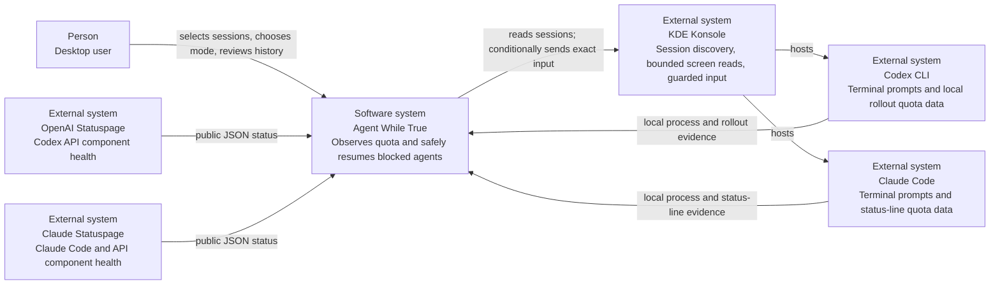
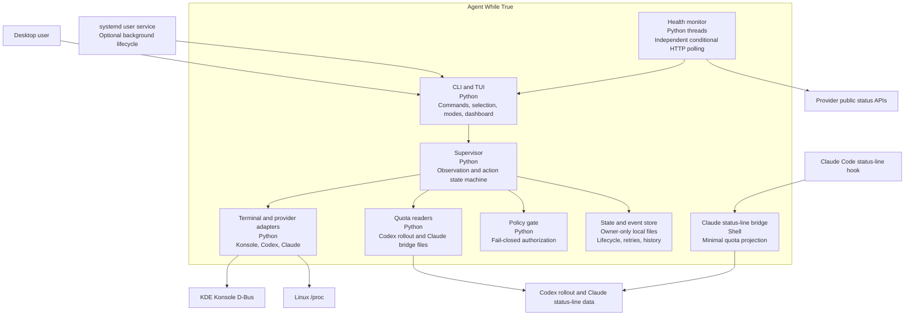
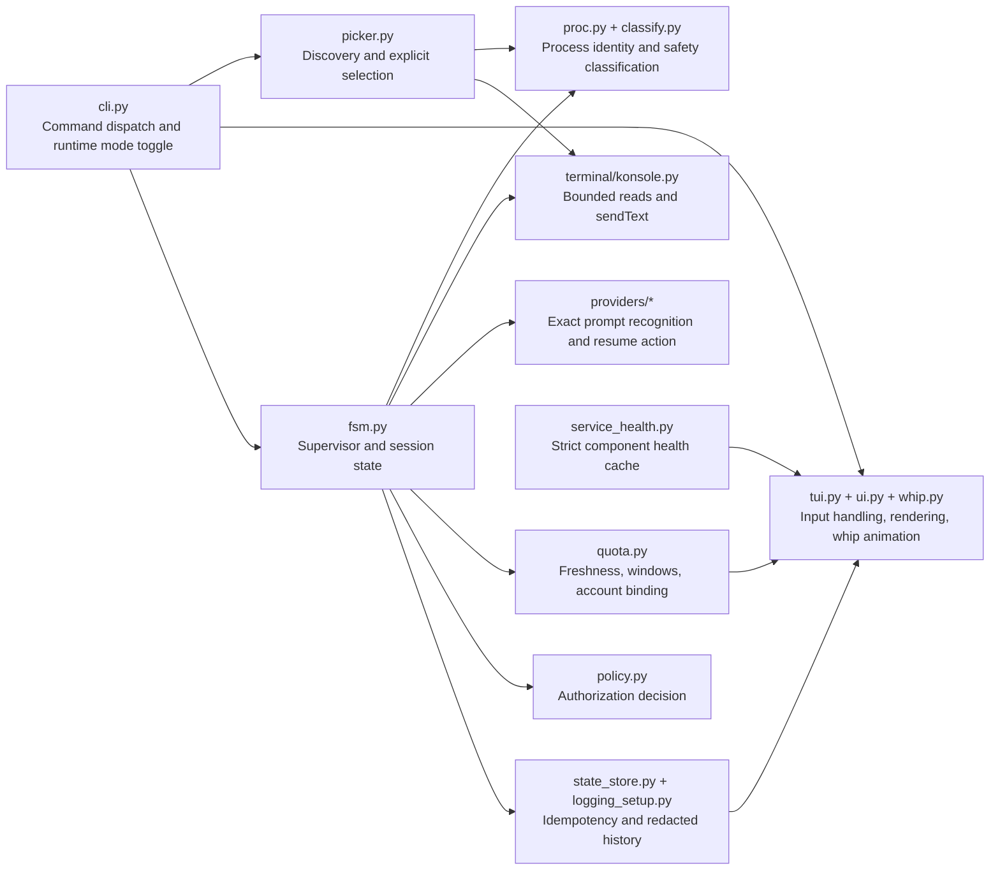
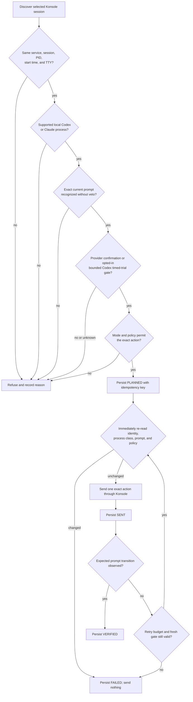
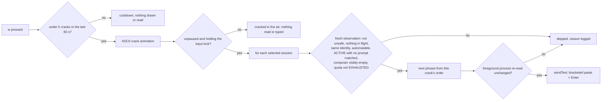
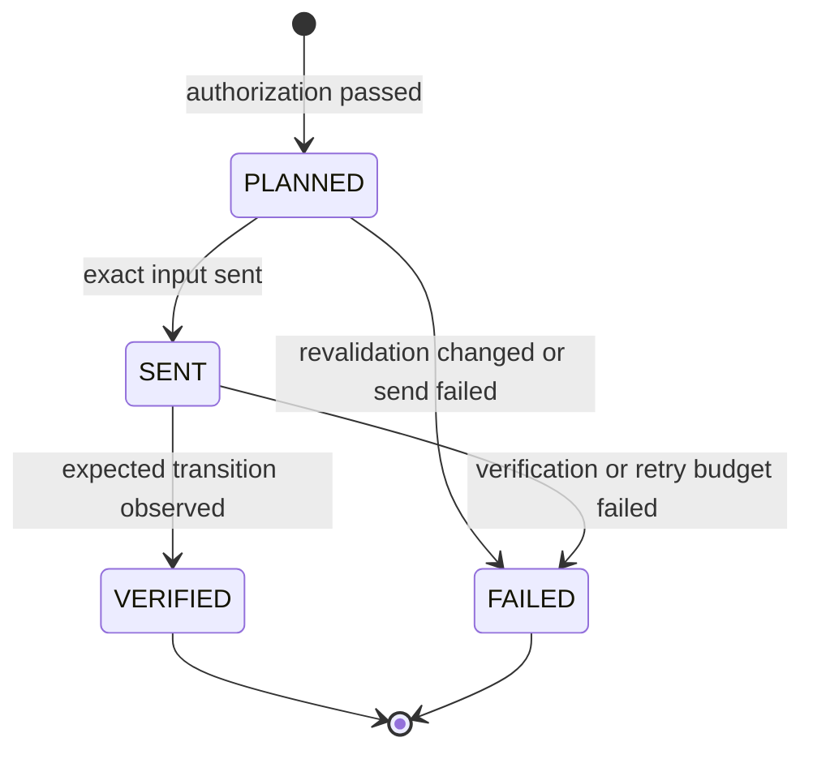
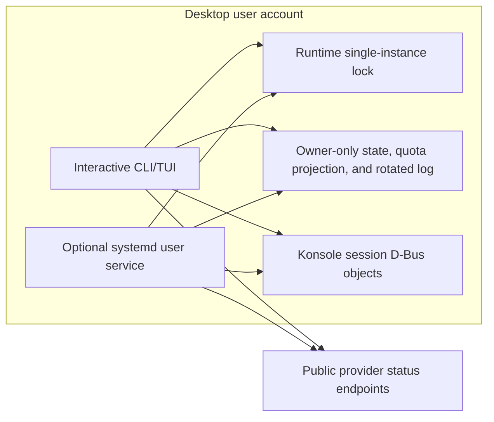

<!--
SPDX-FileCopyrightText: 2026 Marcel Petrick

SPDX-License-Identifier: GPL-3.0-or-later
-->

# Agent While True architecture

This document describes the implemented architecture. It uses the C4 model to
move from the surrounding systems to the runtime components, followed by the
safety-critical action flow. The diagrams use standard Mermaid flowcharts so
they render on GitHub without a C4-specific plugin.

## System context

Agent While True does not call paid model APIs. Provider quota, public service
health, and terminal prompt state are separate evidence sources. No single
source authorizes input by itself.

## Containers

The runtime package has no third-party dependencies. Shell is limited to the
Claude bridge, installation helpers, and quality/release integration.

Presentation preferences live in a separate, versioned owner-only file and
can restore only theme, history length and panel visibility. The detail panel
reads cached decision/observation metadata; it never evaluates authorization.
Responsive rendering and viewport navigation operate solely on presentation.
The screenshot-redaction toggle masks account e-mails at every rendering site,
never changes supervision identity, and is deliberately excluded from saved
preferences so a later run cannot silently inherit its privacy display state.
Persisted presentation fields are merged under an owner-only file lock and
atomically replaced. This prevents concurrent observe dashboards from losing
unrelated updates; transient failures remain dirty and are retried on shutdown.

`metrics.py` batches intervals between consecutive known observations, excluding
pauses and gaps. `summary.py` streams retained structured logs, including rotated
backups, to report event counts and sampled session-time. Both are independent
of the persisted action lifecycle; reports explicitly describe partial coverage.

## Runtime components

The abstractions in `terminal/base.py` and `providers/base.py` keep terminal
transport separate from provider-specific prompts. Deterministic fake-terminal
tests exercise the same supervisor and policy paths as the Konsole adapter.

Claude's status-line bridge hashes the stable Claude session identifier and
writes one owner-only quota document per session. The document also carries the
Claude PID and kernel process start time captured from the status-line parent;
`quota.py` requires both to match the selected process. The installer requests
a 60-second status-line refresh while preserving existing status-line options,
preventing idle quota evidence from silently crossing the 15-minute freshness
limit. A legacy unbound file may be displayed only when no process is supplied
and can never authorize an action for a selected session.

## Guarded resume flow

Observe mode never reaches `PLANNED` or `sendText`. Unknown/stale quota remains
unknown/stale; it does not become available. The sole trial exception is the
owner-requested exact Codex limit composer after an anchored reset, with the
explicit Codex opt-in, persistent episode budget and no fresh contradictory
limit. Claude and other actions still require provider confirmation.

Waiting gates actions, not observations. Each normal scan updates displayed
state; action/verification deadlines can wake the loop sooner. Codex reset
anchors are bound to the selected process and reset hint; a later reset creates
a separate episode. All open same-profile rollouts are considered for quota,
using newest valid windowed evidence rather than file-descriptor order.

## Operator whip

The dashboard's `w` key is the one input path an operator starts by hand. It
is deliberately outside the resume lifecycle: a crack is a single attempt per
session and is never planned, persisted or retried, so a restart cannot repeat
it. It still passes its own revalidating gate in `Supervisor.whip`:

"Composer visibly empty" is provider-specific: Codex's composer row holds
nothing but its placeholder and only its footer follows; Claude's empty cursor
row must sit directly on its input box's closing rule, so a multi-line draft
begun with Shift+Enter is skipped too. Quota is used the other way round from a
resume: exhausted quota blocks a crack, while unknown quota does not, because a
reminder asks for no usage that is not already being spent. Each crack offers
all forty phrases in an order that puts recently delivered ones last, so every
session reached gets a different line. The log records the phrase index, never
its text.

## Persisted action lifecycle

The state store prevents replay of unsettled action keys. Bounded Codex retries
use a persistent session/process/reset episode and a separately reserved action
key for each attempt, so a changed screen fingerprint cannot replenish budget.
Episode reservations and `PLANNED` are durable before the final recheck. That
recheck refreshes quota/prompt evidence, then directly rereads process identity
and classification immediately before `sendText`; no disk write intervenes.
Konsole offers no atomic compare-screen-and-send operation, so a residual
asynchronous boundary remains and must not be described as atomic.

Malformed retry state disables timed trials; pending `PLANNED` attempts are not
replayed after restart. A pending `SENT` can be verified without another send.
An episode that ended in a verified resume with nothing pending is dropped 24 h
after its reset, on load and at every rediscovery; an exhausted episode is kept,
because it is what stops the same process minting a fresh budget.
The event log records identifiers, pattern IDs, decisions,
and lifecycle states, but never screen contents, prompts, credentials, or
environment values.

## Deployment and trust boundaries

Only one input-capable process may hold the runtime lock. Observe-only processes
may coexist. The holder also serves a control socket beside the lock, so a
watcher started later can ask for the lock instead of being locked out for the
lifetime of a service: the holder releases before it answers and re-arms when
the successor exits, which keeps the single-writer guarantee that the lock, not
the protocol, enforces. D-Bus access, state files, and the service all remain
within the desktop user account; root execution, SSH, containers, tmux/screen,
and ambiguous process ancestry are non-automatable.

## Architectural decisions

- Keep provider quota state distinct from terminal prompt state.
- Bind selection to immutable process evidence, not a tab number or project path.
- Revalidate every safety input immediately before terminal input.
- Prefer refusal over inference; allow only the documented, explicitly opted-in
  bounded Codex trial when availability cannot refresh while blocked.
- Keep runtime dependencies empty and external traffic limited to compressed,
  bounded, conditional reads of public status endpoints.
- Persist the action intent before sending so crashes cannot silently duplicate
  an action.
- Route every operator-initiated input, such as the dashboard's whip crack,
  through the supervisor's revalidation; it types only into a plain working
  screen whose own composer is visibly empty, and is never persisted or retried.
- Preserve a narrow adapter boundary for future terminals or providers without
  weakening the current Konsole-specific gate.
