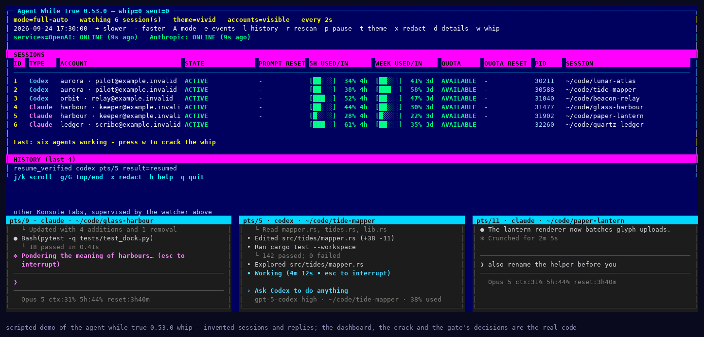
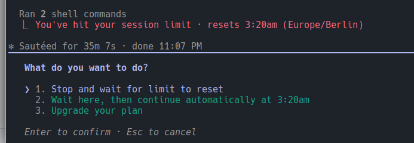

<!--
SPDX-FileCopyrightText: 2026 Marcel Petrick

SPDX-License-Identifier: GPL-3.0-or-later
-->

# Agent While True usage guide

Everything an operator needs after `pipx install`: enabling Konsole input,
choosing sessions and modes, reading the dashboard, configuring the tool,
wiring the Claude quota bridge, and running it as a background service.
[README.md](../README.md) is the short entry page; the safety reasoning behind
each rule is in [vision.md](vision.md) and [ARCHITECTURE.md](ARCHITECTURE.md).

## 1. Enable Konsole input once

Konsole disables input-capable D-Bus calls by default on current releases.
Enable the setting once, then restart Konsole before using ask or auto mode:

```bash
kwriteconfig6 --file konsolerc --group KonsoleWindow \
  --key EnableSecuritySensitiveDBusAPI true
```

This permission lets programs running as your desktop user type into Konsole,
which is why Agent While True layers process identity, exact prompt recognition,
policy, idempotency and immediate revalidation on top. `agent-while-true doctor`
probes the permission with an empty string and blocks auto mode if it is off.

The setting is read when a Konsole process starts. Existing windows remain
input-disabled until Konsole is restarted; keep the current sessions open until
their work is safe, then restart Konsole once and require `doctor` to report
both `Konsole input OK` and `Auto mode OK`. Agent While True cannot bypass this
Konsole boundary and intentionally does not kill or replace existing terminal
sessions.

`doctor` also identifies whether the distribution is in the validated Arch
family, probes `codex app-server --help` as the preferred future Codex
integration, and checks the Claude status-line quota bridge without executing
its configured command. These capability rows are advisory: an unsupported
app-server or an absent Claude bridge warns for that provider but does not
disable safe operation of the other provider. Malformed bridge settings and
private command contents are never printed.

## 2. See what is running

```bash
agent-while-true status
agent-while-true quota
```

`status` classifies visible Konsole sessions. `quota` is read-only and reports
provider availability, failures, usage percentages, and the reset time for each
known window:

```text
Claude pts/4 PID 769257
  availability: EXHAUSTED
  source:       claude-statusline
  session       100.0%  reset 03:20 (4h)
```

Provider state and terminal state are intentionally separate. A quota may be
available while a terminal is active, or a terminal may show an old limit while
provider data is unavailable. Unknown or stale quota never means available; the
narrow [Codex timed-retry exception](#7-codex-specifics) permits a bounded
trial, not a claim that the provider's quota has refreshed. For Codex, a process
whose rollout stopped updating may use a fresher observation from another live
process only when both rollouts resolve to the same validated local account and
rate-limit identity. Unidentified and different accounts are never combined; the
opaque binding remains in memory and is not logged.

Codex is launched through a Node.js shim on current installations, so Konsole
may label its tab or foreground command `node`. Agent While True walks the child
process tree, classifies the native Codex process, reads quota from that
process, and presents the session as `Codex`.

## 3. Choose sessions and a mode

```bash
agent-while-true run --observe --all   # run the full detection path; never type
agent-while-true run --ask             # select sessions and confirm each action
agent-while-true run --auto            # select sessions; resume policy-approved prompts
agent-while-true run --once            # one tick, plain text, exit (for scripts)
agent-while-true simulate --all        # exercise the built-in danger scenarios
```

Without `--all` a picker lists every Konsole session; only sessions positively
classified as Codex or Claude can be selected, and a plain shell is never
preselected. `fzf` is used when installed (`--no-fzf` disables it). With `--all`
every eligible agent is watched and newly opened agent tabs are picked up on
each rediscovery.

Only one input-capable instance may send input at a time. Starting a second one
does not fail: it watches read-only and arms itself as soon as the incumbent
lets go, so a user service stays startable while a dashboard is open. A watcher
can also be started read-only outright:

```bash
agent-while-true run --observe --all  # press Shift+A to take over full auto
```

`Shift+A` in the dashboard switches to full auto and, pressed again, back to the
mode it came from - observe or ask. Enabling full auto this way is an explicit
runtime opt-in to Codex composer continuation (`ALLOW_CODEX_AUTO_RESUME`) that
lasts only while full auto does; paid, upgrade, reset-credit and model-downgrade
policy stays off. Returning to ask keeps input control, since ask mode still
types once you confirm; returning to observe releases it.

If a background service already owns the lock, `Shift+A` asks it to hand input
control over rather than refusing. The service drops to observe and releases the
lock before it answers, the dashboard takes the lock through the ordinary path,
and the service arms itself again once the dashboard exits - so stopping and
restarting the unit by hand is no longer necessary. A handover is refused while
an action is waiting for verification: press the key again once it has settled.
The channel is a socket in the runtime directory, restricted to the owning user,
and carries the mode, process id and version only.

## 4. The dashboard

On an interactive terminal `run` opens a framed color dashboard inspired by
btop and ollamaFarm. Dark, vivid, CGA, and amber style the whole surface; the
plain theme, `NO_COLOR=1`, or `--no-color` produce ANSI-free output. Colors
carry meaning: green is available/healthy, yellow is waiting or unknown, and
red is exhausted or unsafe.

Without a terminal - the user service, a pipe - a continuous `run` writes one
plain line per session (state, quota, reset) and repeats it only when it
changes, so the journal records transitions rather than a frame per scan.
`--once` prints a single frame in full-auto/ask mode and one line per session in
observe mode.

| Key | Effect |
| --- | --- |
| `-` / `+` | Refresh faster / slower across `0.25 0.5 1 2 3 5 10 30 60` seconds |
| `A` | Toggle auto-resume on limit: full-auto and back to observe/ask; uppercase activation is an explicit Codex resume opt-in |
| `p` | Pause/resume; pause performs no terminal or quota polling |
| `r` | Rediscover Konsole sessions immediately |
| `t` | Cycle dark, vivid, CGA, amber, and plain themes |
| `x` | Toggle screenshot-safe redaction of account e-mail addresses |
| `e` | Show or hide persisted action/state history |
| `l` | Cycle displayed history through 5, 10, 20, and 50 retained rows |
| `h` or `?` | Toggle the in-dashboard help |
| `d` | Show or hide the selected session's resume explanation |
| `[` / `]` | Select the previous / next session explanation |
| `j` / `k` | Scroll down / up through the dashboard |
| `g` / `G` | Jump to the top / end of the dashboard |
| `w` | Crack the whip: an ASCII bullwhip snaps across the screen, then one reminder goes to every idle supervised agent (see [The whip](#the-whip)) |
| `y` | Toggle auto-yes: answer `1. Yes` on exact Claude Code permission prompts (see [Permission prompts](#permission-prompts)); off at every start, never saved |
| `q` | Quit and restore the terminal |

The header shows both automation switches side by side with their keys:
`[A] auto-resume on limit: OFF | ASK each | ON (Claude) | ON (Claude + Codex)`
and `[y] auto-yes on permission prompts: OFF | ON - approves any command asked |
ON, inert: ...` (inert outside full-auto, with the reason), followed by the
number of sessions waiting for approval.

Like btop, `+` makes the interval number larger and therefore refreshes more
slowly. Selected sessions use that interval; full Konsole rediscovery runs every
30 seconds or immediately after `r`. Presentation keys redraw cached data and
never multiply terminal or provider polling. Non-interactive observe output
stays ANSI-free and separates scans with a blank line for readable logs.

### Session rows

Every session shows independently recognized terminal state and provider quota.
Red or unknown data does not authorize input; the supervisor fails closed.

- **Account.** A Codex profile home such as `~/.codex-dmo` renders as
  `codex-dmo · business@example.com`, the default as `codex · private@example.com`.
  Claude Code is read the same way from `CLAUDE_CONFIG_DIR`, so `~/.claude-dmo`
  renders as `claude-dmo · business@example.com`. The profile is read from the
  session's own process, never from the watcher's environment, and each profile
  is resolved once per run. Shell aliases cannot be recovered after Zsh expands
  them, but an alias that selects a distinct `CODEX_HOME` or `CLAUDE_CONFIG_DIR`
  leaves that identity on the child process. This display-only identity is
  never written to the log or persistent state.
- **Meters.** Five-hour and weekly used-percentage meters plus time to each
  reset: `[████░] 84% 3h` means 84% used and a reset within three hours.
  Countdowns below two days use `h`, from two days `d`.
- **Resets.** `PROMPT RESET` is parsed from the blocking terminal prompt;
  `QUOTA RESET` is the effective reset reported by the provider quota source.
  A reported reset time does not guarantee available quota.
- **Service health.** Public status of the OpenAI Codex API and Anthropic
  Claude Code/API components, fetched independently every five minutes
  (`SERVICE_STATUS_INTERVAL=5m`) with gzip and ETag revalidation, re-rendered
  from cache at the display interval. `UNKNOWN` is shown whenever the network,
  schema, component identity or status is unusable. These are not paid model
  calls.

### Details, history and layout

The `d` detail panel explains the latest decision, recognized pattern IDs,
quota source and age, exhausted windows, and next scheduled check. It labels old
observations as stale; displayed reset/check times never promise a resume. The
panel uses cached evidence and does not read or send terminal input.

The `HISTORY` panel reads the same privacy-preserving event file as
`agent-while-true logs`. It shows 10 entries by default and retains the latest
50 in memory, so expanding it reveals what happened while you were away.
Successful terminal retriggers appear as `resume_sent`, followed by their
verification result. History records fingerprints and pattern IDs, never
terminal text, prompts, credentials, or environment values.

Below 168 columns, session cards replace the wide table. Details, history and
help wrap to fit; `j` / `k` scroll while the navigation footer stays visible,
`g` / `G` jump to the ends, and opening details or help brings that panel into
view. Resizing clamps the scroll position.

Press `x` before taking a screenshot: `codex-dmo · work@example.com` renders as
`codex-dmo · w…@e….com` in every account field, provider data and supervision
identity are untouched, and the toggle resets when the process exits.

### The whip



`w` cracks an ASCII bullwhip across the whole dashboard, painted in the
current theme (the grip, lash, spark and `CRACK!` each take one of the theme's
colours on its background; the plain theme, `--no-color` and `NO_COLOR` keep
it bare ASCII), and then types a
short, good-humoured reminder into every *selected* session, a different one in
each session. Lines delivered recently wait at the back of the queue, so
consecutive cracks do not repeat them. The fifty lines include "Work faster.
This is work, not your holiday.", "You are a machine. No breaks for you. Ship
it.", "HR says I have to be nice. Nicely: work faster." and forty-seven more,
half of them office-comedy lines in the spirit of The Office and Stromberg.
The line comes first, followed by the project's address and "no reply needed,
just keep working": `Nice plan. Now execute it. (A whip crack from
https://github.com/marcelpetrick/AgentWhileTrue - no reply needed, just keep
working.)`. The address tells a reader of the transcript where the crack came
from; the rest keeps the nudge from burning the tokens it complains about. The
title bar counts this run's cracks and deliveries. At most five cracks fit in
any rolling 60 seconds: a sixth is refused, without the animation, until the
oldest of the five is a minute old, and the title bar counts that cooldown down.
The counter is never saved.

A crack is an input action and passes the same kind of gate as a resume,
revalidated per session immediately before `sendText`:

- Observe mode, a paused dashboard, or another watcher holding input control
  only cracks the whip in the air: the animation plays, the counter moves,
  nothing is read or typed. Ask and auto mode type it; the keypress is the
  confirmation.
- Only selected sessions are considered, never another Konsole tab, and never
  an unsafe session or one whose resume is still being verified.
- The foreground must still be the bound, automatable agent process - no
  shell, SSH, multiplexer or container - re-read last, right before sending.
- The screen must be a plain working screen: any recognised limit, menu, paid
  offer, downgrade or self-resume prompt skips the session, so a crack can
  never resume a limit or answer a question.
- Quota the provider reports as exhausted skips the session even when its limit
  banner has scrolled away: a turn submitted there only earns a new limit
  prompt. Unknown quota does not block a reminder, because a reminder is not a
  resume.
- The provider's own composer must be visibly empty. A draft (yours) or a
  placeholder suggestion skips the session rather than submitting it. For
  Claude, the empty cursor row must sit directly on the input box's closing
  rule, so a multi-line draft begun with Shift+Enter is skipped as well.

The dashboard's last-event line names how many sessions it reached and why the
others were skipped. The log records the phrase number, never its text.

### Saved preferences

Theme, history length, and history/detail/help visibility are saved under the
state directory in `preferences.json` (normally
`~/.local/state/agent-while-true/preferences.json`). Changes apply immediately
and survive restart. Invalid files fall back to defaults; save errors appear in
the dashboard. Mode, permissions, selections, pause, scan timing, account
redaction and the whip counter are deliberately never saved. Field-level locked
updates stop a second observe dashboard from overwriting unrelated choices; a
failed write is retried during clean shutdown.

## 5. Configuration

```bash
agent-while-true init     # write the default file if none exists
agent-while-true config   # show the effective configuration
```

The file is `~/.config/agent-while-true/config`, parsed as `KEY=VALUE` data and
never sourced as shell. Precedence is defaults < file < `AGENT_WHILE_TRUE_*`
environment < command line. Durations accept `ms`, `s`, `m`, `h`.

| Key | Default | Meaning |
| --- | --- | --- |
| `MODE` | `ask` | `observe`, `ask`, or `auto` |
| `SCAN_INTERVAL` | `2s` | How often selected sessions are read |
| `USAGE_POLL_INTERVAL` | `60s` | Provider quota refresh cadence |
| `STATUS_POLL_INTERVAL` | `1s` | Dashboard redraw of cached service health |
| `SERVICE_STATUS_INTERVAL` | `5m` | Real requests to the public status APIs (1s–24h) |
| `RESET_GRACE` | `60s` | Extra wait after a nominal reset |
| `MAX_RESUME_ATTEMPTS` | `3` | Attempt budget per prompt outside Codex timed retries |
| `RETRY_DELAYS` | `5s 30s 60s` | Back-off between those attempts |
| `RETRY_SCHEDULE` | `1,2,3,5,8,13,21,34,55,89,600` | Opted-in Codex timed-retry delays (11 attempts) |
| `VISIBLE_LINES` | `40` | Screen lines read per observation |
| `RESUME_AFTER_RESET` | `true` | Master switch for any continuation |
| `ALLOW_CLAUDE_AUTO_WAIT` | `true` | May arm Claude's own "wait, then continue" menu item |
| `ALLOW_CODEX_AUTO_RESUME` | `false` | May type `continue` into Codex's composer |
| `AUTO_ACCEPT_MODEL_DOWNGRADE`, `AUTO_USE_PAID_CREDITS`, `AUTO_BUY_CREDITS`, `AUTO_CONSUME_RESET_CREDIT` | `false` | Never enabled by the supplied configuration |
| `LOG_FILE`, `STATE_DIR`, `RUNTIME_DIR` | XDG defaults | Paths |
| `ALLOW_ROOT`, `USE_FZF` | `false`, `true` | Diagnostics-only root; optional fzf picker |

## 6. Logs and summaries

Logs and state live under `~/.local/state/agent-while-true/`; terminal contents
are never logged. The structured event log records when an action was planned,
sent, verified, refused, retried, or failed:

```bash
agent-while-true logs -n 40
journalctl --user -u agent-while-true.service -f   # service lifecycle/output
```

`agent-while-true summary` reports the last 24 hours, `summary --days 7` a
rolling week. Reports read only the configured event log and its five rotated
backups; they never query terminals or providers. Counts distinguish sent
actions, verified resumptions, armed Claude automatic waits, failures, and
refusal episodes (a changed refusal reason counts again; repeated polls of the
same refusal do not).

Every auto-yes answer is an `approval_sent` event with provider, session,
process and the permission box's fingerprint - never the command - and every
refused one an `approval_refused` with its reason. The summary counts them as
`Auto-yes: approved=N resent=R refused=M sessions=K` - `resent` counts the
second Enters on a box that stayed - next to `Whip: cracks=C
reminders=R`, so a day or week shows everything the dashboard typed on its
operator's behalf:

```text
Auto-yes: approved=4 resent=0 refused=0 sessions=2
Whip: cracks=4 reminders=2
```

Measured blocked and observed session-time sums intervals between consecutive
known observations across watched sessions. It is sampled supervision time, not
provider execution time. Pauses, unknown states, clock jumps and long gaps are
excluded, and waiting without fresh observations is not inferred. Intervals are
flushed about once per minute and on clean exit, so a crash can lose the
unflushed tail. Older logs lack interval/refusal evidence, rotation can remove
events, and multiple observers contribute separate samples — use one watcher for
a non-overlapping report. A dashboard opened beside the background service is
such a second observer: both write every state change to the same log, so the
lines appear twice (see
[Opening the dashboard while the service runs](#opening-the-dashboard-while-the-service-runs)).

## 7. Codex specifics

Codex offers no "press enter to continue" affordance: resuming means typing
into its composer, which is strictly more dangerous than pressing a key, so
Codex continuation stays off until `ALLOW_CODEX_AUTO_RESUME=true` is configured
or `Shift+A` opts in at runtime.

Current Codex versions append Pro and credit-purchase links to the ordinary
usage-limit message. Those links are passive text above a separate composer:
Agent While True may type its continuation into that composer only after the
exact tested limit/reset message and either fresh provider availability or the
opted-in bounded retry gate agree. It never follows or selects a paid link, and
any additional paid, reset-credit, or model-changing prompt vetoes the action.

Codex treats a rapid text-and-Enter stream as a paste and turns that Enter into
a newline. The continuation is therefore wrapped in bracketed-paste markers and
followed by Enter in the same revalidated D-Bus write, so a genuine submit
happens instead of leaving `continue` in the composer.

An empty Codex composer is one that shows nothing after its `›` glyph or one
of its placeholders - "Ask Codex to do anything" or, since 0.158, "Ask a
follow-up question" - with only the status line (`Context 93% left`,
`7% used`) and exact status chrome below it. That chrome includes the key hints
(`? for shortcuts`, `tab to queue message`), Codex 0.160's warning counter
(`⚠ 1 warning · f2 to view`) and its Plan-mode cycle hint. An unrecognised row
still counts as a draft.
Anything else is a draft, and the whip leaves it alone. Checked against Codex
CLI 0.158.0 on 2026-09-28, 0.159.0 on 2026-09-29 and 0.160.0 on 2026-10-03:
the limit, retry, credit and downgrade wording is unchanged. 0.159 replaced
"Redeem usage limit reset" with a reset menu opened by `$` ("Usage limit
resets", "Choose a different reset", "Resetting your usage..."); every part
of it vetoes input, because a usage limit reset is finite and earned.

### Timed retries

With full-auto and `ALLOW_CODEX_AUTO_RESUME=true`, the exact tested Codex limit
banner and empty composer may receive a bounded trial continuation after their
anchored reset. A stale/unknown quota display stays stale/unknown; this
deliberate exception does not apply to Claude.

`RETRY_SCHEDULE=1,2,3,5,8,13,21,34,55,89,600` configures 11 attempts. The first
delay replaces reset grace on this path; subsequent delays begin after the
previous attempt's verification finishes (normally one second plus latency), so
the delays are not absolute offsets from the reset. Near deadlines wake the scan
loop sooner than its ordinary interval.

The same prompt keeps its first observed reset date across midnight and
restarts. On a late first sighting, a matching absolute quota-window timestamp
can corroborate the date even when its availability sample is stale. Without a
reliable date the watcher does not guess a past reset. A pre-limit available
sample never permits input before the printed reset; fresh exhausted later
windows, an unknown exhausted-window reset, or a new post-reset exhaustion
sample still veto the trial.

Attempts are reserved persistently before sending and belong to the session,
process identity and reset episode, not the changing screen fingerprint. An
unsettled `PLANNED` attempt after a crash stays blocked rather than being
replayed; corrupt retry state disables timed trials. After the budget is
exhausted the detail view reports `retry-budget-exhausted`. Manual recovery or
a changed, later reset ends or replaces the episode; waiting sessions remain
observed. Logs include session, process, episode, attempt and next deadline;
summaries count scheduled attempts and exhausted episodes.

## 8. Claude specifics

Claude continuation is a bare Enter, and only when Claude explicitly asks for
it ("usage limit has reset … press enter to continue") on a session the
supervisor itself saw held at a limit since its last verified resume. The
affordance answers that limit; on its own it authorises nothing, however
available the quota looks, so a single `run --once` scan, a restart while
Claude waits, or an agent merely quoting the line is refused with
`ready-without-preceding-limit` and left for a human. Claude's exact
three-choice limit menu may also be armed so Claude itself continues at reset:
auto mode moves from the visibly selected first item to the exact "wait here,
then continue automatically" item and confirms it. It never selects "upgrade
your plan", and any different menu or cursor position fails closed. Set
`ALLOW_CLAUDE_AUTO_WAIT=false` to disable arming.

Arming needs evidence that the session is out of usage, which is either a fresh
quota sample reporting the window exhausted or Claude's own limit banner above
the menu. The banner is required because the quota bridge cannot supply that
evidence here: Claude's status line caps the five-hour figure at 99 %, the limit
that fires is sometimes a window the status line does not report at all, and a
session parked on the menu stops refreshing its status line, so the sample goes
stale exactly when it matters. A menu whose banner has scrolled out of the live
window still fails closed. Arming is not a claim that usage returned — it only
hands the waiting back to Claude — so a first-hand banner outranks the gauge,
just as "usage limit has reset" outranks a clock.



Claude Code 2.1.283 builds its limit headline at runtime ("You've hit your
<limit>", optionally "· progress saved"). Two kinds are told apart. Window
limits reset by waiting and block like the session limit: the session, weekly,
Opus, Sonnet and fast limits, "You've reached your Fable limit", and the
unnamed "You've hit your limit" / "... usage limit". Caps that no wait lifts -
"usage credit limit", "You're out of usage credits" or "extra usage", "Fable 5
requires usage credits", an org's, channel's, team's or individual spend or
usage limit, "Your org is out of usage", a seat type without usage, a disabled
allocation, a group limit of $0 - are paid or admin choices: every one vetoes
input, including arming Claude's own wait.

An armed wait makes the supervisor stand down in every wording Claude uses:
"Continuing automatically when it resets", "... at 6:50pm", "... at 7pm" (zero
minutes are dropped), "... at Oct 3, 7pm" (a reset more than a day out) and
"... shortly". Since 2.1.284 these lines are templates Claude can change
remotely; a wording the patterns do not know leaves the wait unrecognised,
which `doctor`'s version check and a live read are there to catch.

### Permission prompts

When Claude Code asks for permission - "Do you want to proceed?" under a tool
header such as *Bash command*, or "Do you want to overwrite
settings.local.json?" / "Do you want to create notes.py?" under a file preview
- the session shows `APPROVAL_PENDING`. The detail panel (`d`) says whether
the prompt is an exact tested permission menu, at the bottom of the screen:

```text
 Do you want to <anything>?
 ❯ 1. Yes
   2. Yes, and <a session or settings choice>      (optional)
   3. No[, and tell Claude what to do differently]  (2. No without item 2)

 Esc to cancel · Tab to amend
```

with the box's solid top rule above the question, or the dashed rule right
above it when a file preview fills the window. A cursor anywhere but item 1, a
fourth item, a reworded item, or text below the footer is an untested shape to
answer in the tab itself. A permission prompt is never a resume prompt: no
mode answers it on its own, and the command text is never logged.

**Why it exists.** On an account whose Claude Code managed settings keep
permission prompts on - no bypass mode, no broad allow rules - an agent stops
at every tool call it cannot pre-approve, and a supervised session sits idle
until someone comes back to the tab. Auto-yes lets such a limited account keep
working unattended, within the gates below. It was validated live on
2026-09-28 with Claude Code 2.1.283: two sessions on a managed account were
answered (`approval_sent`) and back to `ACTIVE` within two seconds each.

**Auto-yes (`y`).** The dashboard's `y` key switches auto-yes on and off; the
header shows `[y] auto-yes on permission prompts: OFF|ON` and how many sessions
wait for approval. While it is on, every scan answers each exact permission
menu with Enter on the visibly selected `1. Yes`, the one-time approval. **That
approves whatever command or file write the agent asked for** - including an
edit to its own `.claude/settings*.json`, which a Bash command could make just
as well - so it starts off on every run, is never saved, and
exists only in the interactive dashboard - the headless service cannot enable
it. Each answer is gated like any other input:

- it answers only in full-auto: ask mode keeps its promise to confirm every
  action, and observe mode, a paused dashboard or a watcher without input
  control types nothing; the header then says `ON, inert`;
- only an exact tested menu qualifies, alone on the screen: a limit, paid
  offer or wait menu beside it, or the cursor anywhere but `1. Yes` is
  refused, and Enter on item 1 never reaches a "Yes, and ..." item that would
  change Claude Code's settings or switch the session to accept-edits mode;
- the box is re-read immediately before the keypress and must be the one the
  scan saw - a different command, an edit, a replaced process or another
  foreground program cancels it;
- one Enter per appearance: the same box is answered again only after a scan
  has seen it leave the screen - with one exception. Seen live on 2026-09-30
  with 2.1.285, an answered box stayed on screen unchanged; the likely cause is
  an Enter dropped while Claude Code was still setting the dialog up, but the
  log (which holds no screen text) cannot prove it. So the identical box still on
  screen 3 seconds after its answer gets exactly one more Enter, through the
  same revalidation (`approval_sent` with `reason=resent`). If it outlives that
  one too, the scan reports `unanswered-after-resend` once, the session details
  say to answer it in its tab, and auto-yes leaves it alone until it leaves the
  screen. Switching `y` off and on does not grant another try;
- nothing is persisted, and the log records `approval_sent` or
  `approval_refused` with identifiers, a box fingerprint and a reason - never
  the command.

For commands you approve every time, an allow rule in Claude Code's own
settings (`/permissions`) is narrower and matches the real command rather than
its rendering, and leaves every other prompt with you.

### Quota bridge

Claude Code exposes quota data only to its configured status-line command. The
bridge is the supplied `scripts/claude-statusline-proxy.sh` — not another
package, daemon, plugin, or network service. It receives that JSON, copies only
the usage windows, reset timestamps, a hashed session identifier, and the
Claude process identity to Agent While True's state directory, then runs your
existing status line with the original JSON. Each selected session accepts only
the quota file bound to its exact PID and process start time.

Without it, `agent-while-true quota` reports Claude as `UNKNOWN` with
`no-statusline-file`. Prompt detection still works, but automatic mode will not
guess that quota is available.

Install and chain the supplied file in one command:

```bash
scripts/install-claude-bridge.sh
```

The installer copies the proxy, backs up `~/.claude/settings.json`, preserves
the existing status-line command and other status-line settings, and configures
a 60-second refresh so quota stays current while Claude is idle.

To do it by hand, install the one supplied file and point Claude's `statusLine`
at it, passing the previous command (if any) through
`AGENT_WHILE_TRUE_STATUSLINE_CHAIN`:

```bash
install -Dm755 scripts/claude-statusline-proxy.sh \
  ~/.local/share/agent-while-true/claude-statusline-proxy.sh
```

```json
{
  "statusLine": {
    "type": "command",
    "command": "AGENT_WHILE_TRUE_CLAUDE_PID=$PPID AGENT_WHILE_TRUE_STATUSLINE_CHAIN=~/.claude/my-statusline.sh ~/.local/share/agent-while-true/claude-statusline-proxy.sh",
    "refreshInterval": 60
  }
}
```

Omit `AGENT_WHILE_TRUE_STATUSLINE_CHAIN=…` when there was no status line before.
Restart Claude Code if it does not reload the setting, wait for one status-line
render, then verify without enabling automation:

```bash
agent-while-true quota
ls -l ~/.local/state/agent-while-true/quota/claude-*.json
```

The bridge writes one owner-only, atomically replaced quota document per Claude
session. Legacy global files are display-only and cannot authorize an action for
a selected process. Bridge failures never prevent the existing status line from
running.

## 9. Background service

Install and enable the supplied observe-only user service from a checkout:

```bash
scripts/install-user-service.sh
systemctl --user status agent-while-true.service
```

The shipped service is observe-only: it discovers new agent tabs but can never
send input. After validating `doctor`, `quota`, observe mode and the
simulations, install the managed auto-mode drop-in — optionally with the
separate Codex composer opt-in:

```bash
scripts/install-user-service.sh --auto
scripts/install-user-service.sh --auto --allow-codex-auto-resume
```

Both forms enable and start `agent-while-true.service` immediately and on
future desktop logins. Running the installer without `--auto` restores the
managed observe-only configuration; `--uninstall` removes the service and its
drop-in.

The service runs `~/.local/bin/agent-while-true` and keeps the code it started
with. Install a newer version with `UV_VENV_CLEAR=1 pipx install --force ...`
(see [Install](../README.md#install); without the variable pipx's uv backend
keeps the old environment and reports success), check
`agent-while-true --version`, then restart it:

```bash
systemctl --user restart agent-while-true.service
```

### Opening the dashboard while the service runs

There is no attach-only viewer: every `run` is a complete watcher that scans the
selected sessions and writes its own log lines. With the service running, pick
one of two ways:

- **One watcher, one log.** Stop the service, use the dashboard, and start the
  service again when you leave:

  ```bash
  systemctl --user stop agent-while-true.service
  agent-while-true run --auto --all
  systemctl --user start agent-while-true.service   # after quitting
  ```

- **Keep the service and take input control.** Open a read-only dashboard and
  press `Shift+A`; the service hands input control over, drops to observe and
  re-arms when the dashboard exits (see [§3](#3-choose-sessions-and-a-mode)):

  ```bash
  agent-while-true run --observe --all   # then Shift+A
  ```

  Both processes keep scanning and logging, so every state change is logged
  twice, and `summary` counts both watchers' samples.

## 10. One-shot full-auto launcher

```bash
./fullAutoMode.sh          # or --noRun to set up and check without opening the TUI
```

From a checkout, the launcher runs the complete release gate, installs that
verified wheel with `pipx`, creates the default configuration if needed,
requires `doctor` to pass, shows live status and quota, and opens the auto-mode
dashboard for all eligible sessions. Invoking it explicitly opts Codex into
composer continuation; paid, upgrade, reset-credit and model-downgrade actions
remain forbidden. If another input-capable watcher already owns the lock it
stays in control and the launcher opens an observe-only dashboard instead, where
`Shift+A` asks that watcher to hand input control over.
